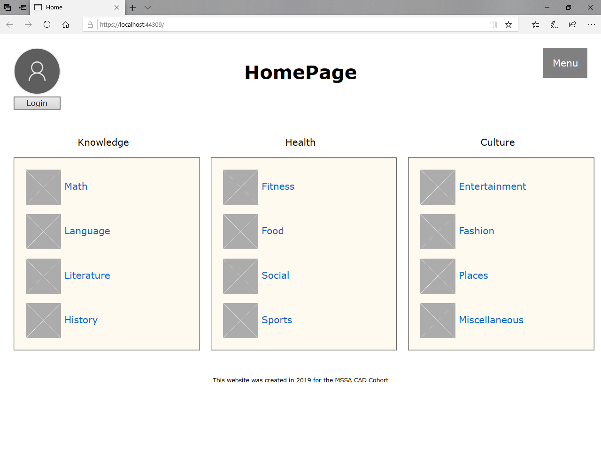
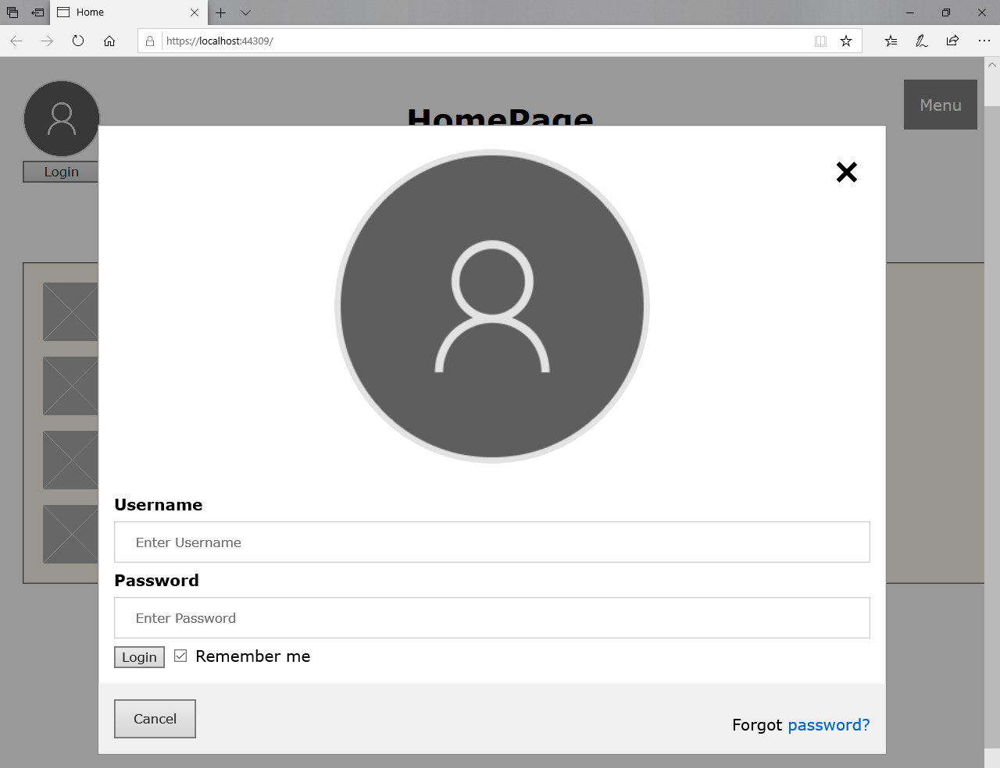
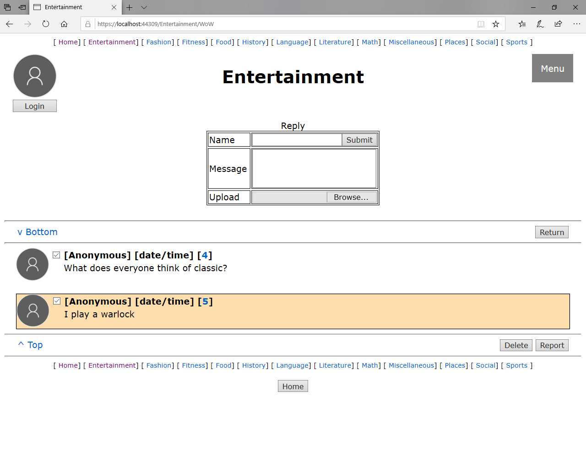

# TwaddleCate Prototype

This is the prototype for the message board project. It is just for demonstration.

## Home Page

This is the home page to the website. You can log in (or not), choose some other places on the site from the menu, or go to one of the Topics usig the links inside of the boxes. Both the word and the picture (coming eventually for each) point to an associated view.

### Login

This will let users log in if they have an account. Their picture in the corner of every page will change to a profile picture that they add. For now, user account creation is only available by emailing the site developer, as I don't really want users to upload their own pictures without a strong filter (IE, someone looking at each profile).

## Menu Pages
### About

This is a simple page that talks about the site. There is nothing here but blocks of text.

### News

This is a simple page that talks about the development of the site and where it is headed (new features and stuff). More blocks of text.

### Contact

Contact info if you want to send the site developers (me) an email. This is the only way to get an account at the moment.

## Topic Page

Styled after the Chans. The pictures will change based on who posted. Each message created will point to itself, which is it's own start of a discussion. Each first post will be listed on this page. There are links to get to the other topics on top and bottom, will have page scrolling when there are multiple pages, a button to return to home screen at bottom, and the standarn menu functions. You can also search for things that are contained in the original post. I will probably have to add titles to each of the posts, but for now it goes by the body of the message. Non anonymous users will be able to delete their post if they have he checkmark checked, and anyone can report anything that has the checkmark checked.

## Discussion Page

Very similar to the Topics view, this has the same format, but each response is styled differently from the person who created it. Styled again off the Chans. Functionality remains the same as the topic view. Linking between posts based on number will also be a thing at some point.
